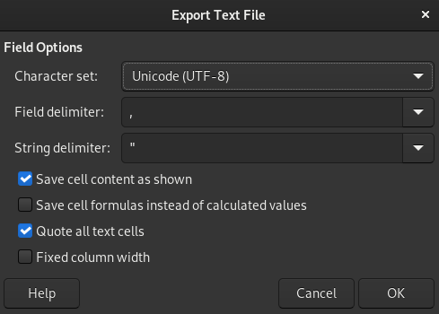

# Open Data Salud (Colombia)

Este es un repositorio con el propósito de facilitar el acceso a datos de salud
para Colombia. Tratamos de mantener datos actualizados de los códigos CIE-10 en
formato CSV y esperamos pronto incluir más datos como un catalogo de CUPS y
CUMS.

## Buscamos colaboradores

Este es un repositorio público y de libre uso. Si existen errores en los datos
incluidos en el repositorio, posibles mejoras o actualizaciones a los
estandares, te invitamos a contribuir. Puedes ayudar abriendo un issue o mejor
aun, actualizando los datos tu mismo y abriendo un Pull Request.

## Como exportar los CSV

Es óptimo exportar los CSV en LibreOffice o cualquier otro programa con la
condición que mantenga las siguientes opciones:

1. Todas las celdas de texto deben llevar comillas `"`.
2. El delimitador debe ser una coma `,`.

